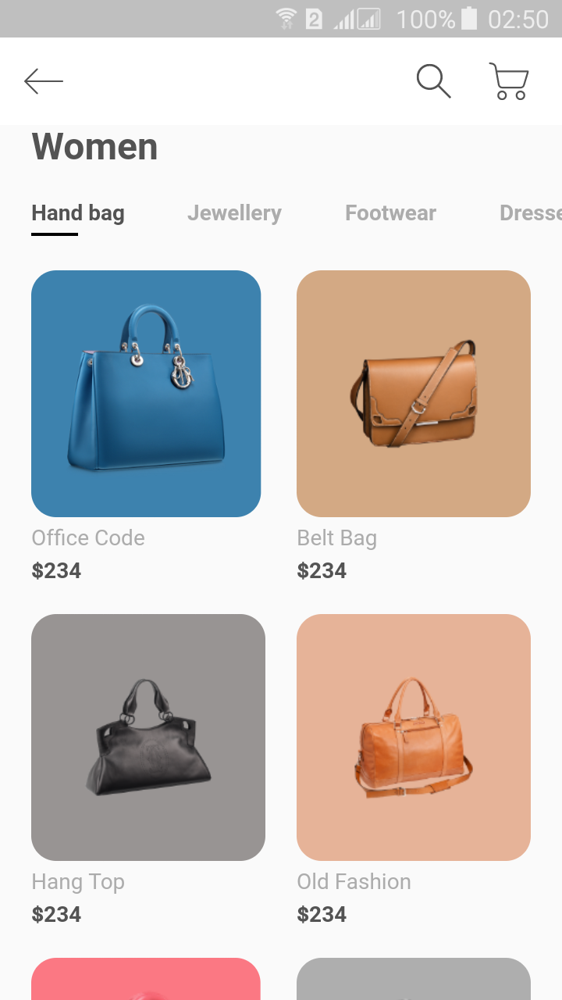
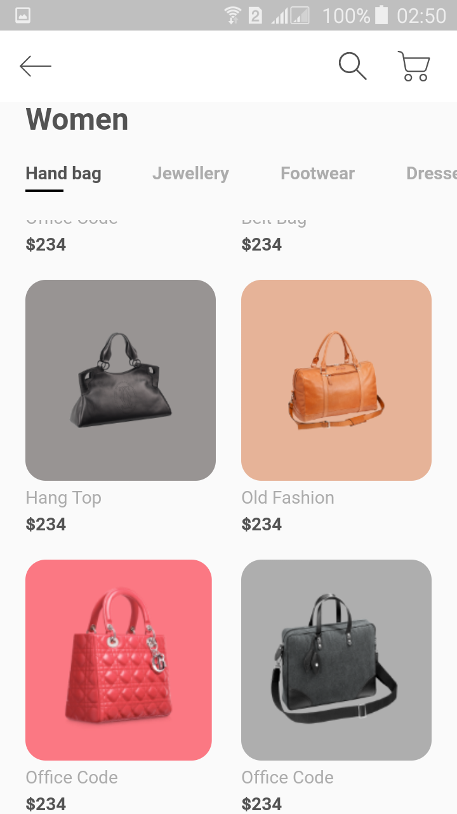
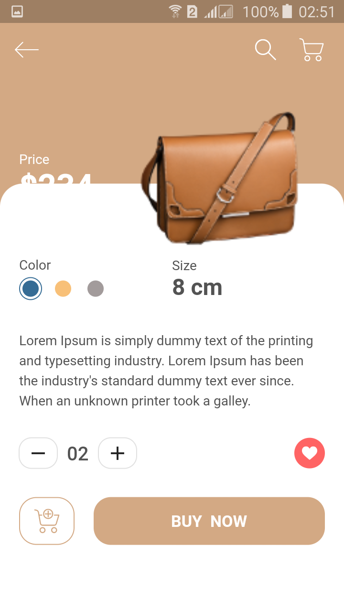
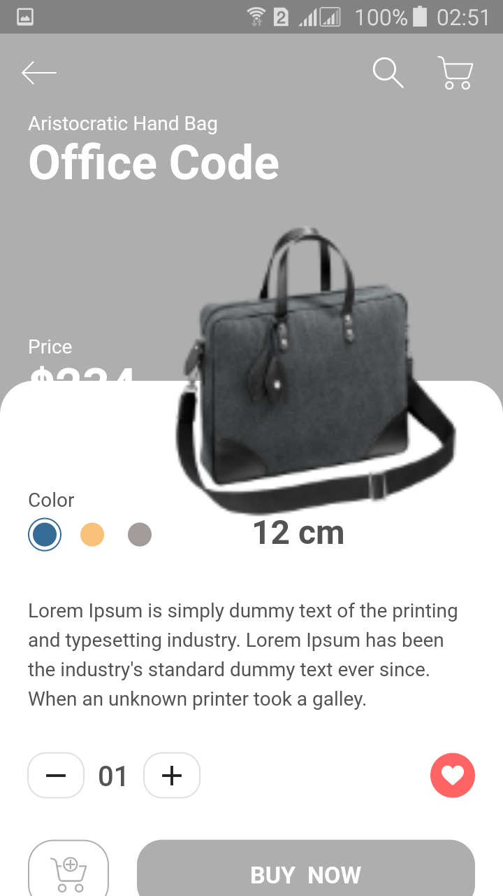

# Shop-App-Flutter

## Overview
Building an E-commerce Application UI using Flutter, dart for Android, and iOS.
Building an E-commerce app UI has two pages:
1. Women Products Screen for the product page which has a horizontal list of categories then a list of our products.

2. Details Screen which shows the price and short description of the product with the Buy Now button.

---
## Screenshots

|        Women Products Screen         |  Women Products Screen with Scroll   |
| :------------------------: | :------------------------: |
|  |  |

|     Product Details Screen      |  Product Details Screen with Scroll   |
| :------------------------: | :------------------------: |
|  |  |

---